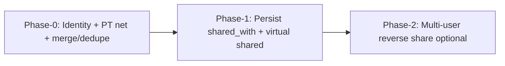
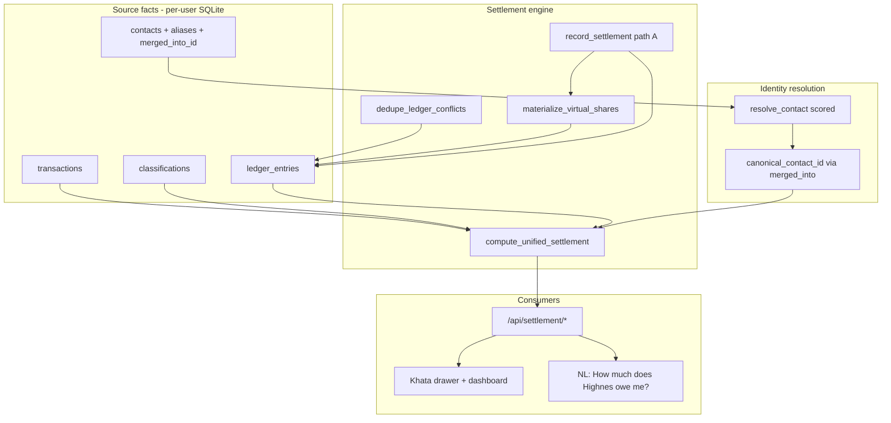
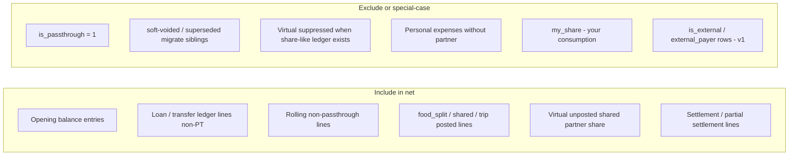
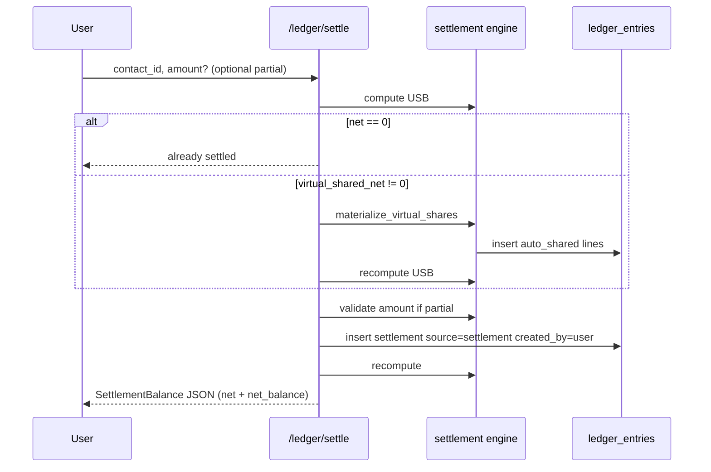
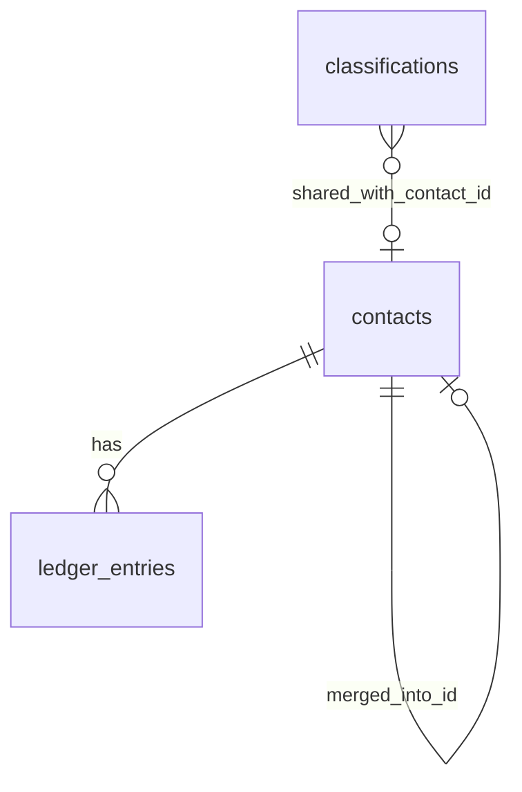

# Unified “Highnes Owes Me” Settlement Model

| Field | Value |
|-------|--------|
| **Author** | Design (Grok) — product owner: Anand |
| **Date** | 2026-07-22 |
| **Revised** | 2026-07-22 (open questions resolved by product owner) |
| **Status** | **Approved for implementation** |
| **Project** | AI-Powered Personal Expense Tracker (`i-want-to-build-an-ai`) |
| **Primary code** | `expense_tracker/contacts.py`, `services.py`, `db.py`, `web.py`, `classifier.py`, `templates.py` |

---

## Overview

Today the app answers “who owes whom” in three disconnected places:

1. **Contact Ledger (Khata)** — `contacts` + `ledger_entries` with directions `you_sent` / `they_sent`. Net = Σ(you_sent) − Σ(they_sent); positive means **they owe you**.
2. **Shared expense classifications** — `classifications.expense_type = 'Shared'` with `split_ratio`, `my_share`, and optional `shared_with`. Partner’s unpaid share is conceptually the residual after `my_share`, but is **never folded into Khata** — and today **`shared_with` is never persisted** (see [Current-state bugs](#current-state-bugs-blocking-usb)).
3. **Partner balances** — `compute_partner_balances()` over multi-user usernames; formula is wrong for unequal splits, dead code on debit, silent `except`; `get_household_balances` always returns empty. Dashboard home uses `compute_partner_balances(conn, username, all_users)` (not the empty helper).

The product goal is a **single settlement number** for any person (e.g. Highnes):

> **“How much does Highnes owe me?”** (and the reverse)

This design introduces a **Unified Settlement Balance (USB)** computed from a single domain function that:

- treats the contact ledger as the **system of record for money movements and settlements**,
- **virtually** (or optionally **posts**) shared-expense partner shares into that balance,
- **never double-counts** when a shared expense already has a linked ledger line (merge-group aware),
- **mandates ledger dedupe** after merge / passthrough confirm so Highnes is not still wrong after identity cleanup,
- correctly handles **Loan / Transfer / pass-through / opening balance / partial settlement**,
- resolves messy **identity** (merchant fragments vs seeded “Highnes”) with ranked matching and **no auto-create on detect**,
- exposes one **API** for UI drawers, dashboard cards, and future NL.

Implementation is **phased**: Phase-0 (identity + PT net + merge/dedupe) unlocks a correct Highnes *ledger* answer first; Phase-1 adds virtual shared after partner persistence. See [PR Plan](#pr-plan).

---

## Background & Motivation

### Current state (code + live data)

| Layer | Location | Behavior today |
|-------|----------|----------------|
| Ledger write | `contacts.add_ledger_entry` | Dual-writes `direction` + `entry_type`; purposes include `loan`, `rolling`, `food_split`, `trip`, `settlement`, `other` |
| Ledger balance | `contacts.calculate_contact_balance` | Counts **all** rows; pass-through still affects net |
| Ledger UI | `web.handle_api_contact_ledger`, `templates.render_contacts_section`, `static/app.js` | Drawer shows running history; settle posts full compensating entry only (`abs(net)`); JS reads `bal.net_balance` |
| Shared math | `classifier.effective_share` | Loan/Transfer → `my_share = 0`; Shared uses `split_ratio` on debit side of `amount_signed` |
| Shared partner tag | `classifications.shared_with` | Column exists; **never written by review path** |
| Partner balances | `services.compute_partner_balances` | SELECT omits debit; dead first-sum; then `sum(my_share)`; bare `except: pass`; home page passes `all_users` |
| Multi-user sync | `web.sync_shared_transaction` | Copies txn into partner DB when called — but partner never stored on classification |
| Legacy columns | Live DB only | `contacts.upi_id`/`phone`; `ledger_entries.passthrough_contact_id` — not in current `init_db`; migrations must use `_safe_add_column` |

**Live `expenses_anand.db` facts (2026-07-22):**

- Seeded contact **Highnes** (`id=25`, aliases include `highnes.7@sibl`, `8078866770`, `dr highnes sibl`) has **0 ledger entries**.
- Fragment contacts hold all Highnes money: e.g. `Highnesj Sibl` net **−₹1,00,562** (they_sent only, 15 rows), `Dr Highnes Sibl Highnes` **+₹15,000**, etc.
- **36** Shared expenses; **all** `shared_with = NULL` (35/36 at `split_ratio=0.5`).
- Pass-through confirmations **auto-create** merchant-name contacts (`Highnes Icic`, `Highnes Ppiw`, …).
- **Duplicate economic events:** txn `2` has both migrated non-PT `they_sent` ₹8000 (`ledger id=1`, `created_by=auto`) and later PT `they_sent` ₹8000 (`id=66`). Same pattern for txn `17` (₹2000).

### Current-state bugs (blocking USB)

| Bug | Detail |
|-----|--------|
| **Review never persists partner** | `web` handlers read `shared_with` form params and may call `sync_shared_transaction`, but **never** `UPDATE classifications SET shared_with=...`. `db.review_transaction(...)` has **no** `shared_with` parameter. `templates.py` has **no** partner control (only People/`split_people`). Audit’s “shared_with dropdown” claim is **stale**. Virtual shared net will stay **0 for everyone** until the write path exists. |
| **Merge without dedupe is wrong** | Excluding `is_passthrough=1` alone does **not** fix migrate+PT siblings. After naive Highnes* merge, excl-PT net remains ≈ **−₹90,562** of mostly migrated `they_sent` that duplicate later PT confirms. |
| **Identity first-match** | `find_contact_by_text` walks `ORDER BY name ASC`; full fragment names often match before shorter seeded Highnes. |
| **Partner balance** | Wrong for `split_ratio ≠ 0.5`; on live DB (almost all 50/50) `my_share == partner_share` so the bug is **latent**, not currently 2×. `get_household_balances` is always empty; dashboard uses `all_users` path instead. |

### Pain points

1. **No single answer** for “Highnes owes me X” across loans, UPI rollings, and food splits.
2. **Identity fragmentation** + **duplicate ledger economics** make Khata wrong even after merge unless dedupe is mandatory.
3. **Shared expenses do not create settlement liability** — and partner is not even stored on classify.
4. **Pass-throughs inflate / skew net**; confirming PT again does not upgrade migrated non-PT siblings.
5. **Partner balance path** is multi-user-only and not contact-aware (Highnes has no app account).
6. Future AI/NL Q&A has nothing correct to call.

---

## Goals & Non-Goals

### Goals

1. One canonical function: `compute_unified_settlement(conn, contact_id) → SettlementBalance`.
2. Correct composition of ledger money, outstanding shared shares (when attributed), settlements, opening balances.
3. **No double-counting** (txn+canonical contact; share-like suppress; merge-group aware).
4. Pass-through exclusion + **upgrade-on-confirm** for existing non-PT siblings.
5. Identity linking with **ranked resolution**; merge + **mandatory conflict/dedupe resolution** for Highnes pack.
6. Unified read API for UI + AI; write paths for persist partner, settle (incl. materialize-on-settle), partial settle, merge+dedupe.
7. Safe migration without loss; soft-void rather than hard-delete where possible.
8. Worked Highnes rupee scenarios including **live-shaped** migrate+PT+dedupe.

### Non-Goals (this design)

- Full multi-party split tables (N people with unequal ratios / multi-contact residual) — keep `split_ratio` / people UI; **one** `shared_with` only; residual `base − my_share` is attributed to that single partner (not multi-friend fairness).
- Real-time two-way sync of settlements across partner DBs.
- Replacing bank `transactions` immutability or silent reclassification of historical merchants.
- Cryptographic audit / legal debt instruments.
- Mobile-native UI redesign.
- **v1 USB ignores** partner-paid / reverse share rows (`is_external`, `external_payer`) — phase 2 only.
- Auto-entering USB from Loan/Transfer **classifications** alone (ledger link still required). Loan-purpose ledger rows on non-person merchants are out of scope for Highnes cleanup.

---

## Proposed Design

### Phased delivery (product)



| Phase | Delivers | Depends on |
|-------|----------|------------|
| **0** | Correct Highnes *ledger* USB: ranked match, no auto-create, exclude PT, merge+**mandatory dedupe**, upgrade-on-PT-confirm | Schema soft columns optional |
| **1** | Partner picker + **persist** `shared_with`/`shared_with_contact_id`; virtual shared; settle with materialize-on-settle | Phase-0 recommended before UI default |
| **2** | `is_external` / reverse share in USB | Explicit non-goal for v1 |

Phase-0 alone answers most of “How much does Highnes owe me?” because live shared rows have **no partner** and virtual shared is currently zero for everyone.

### High-level architecture



### Domain model

#### Sign convention (unchanged, made explicit)

| Concept | Meaning | Sign on **net** |
|---------|---------|-----------------|
| `you_sent` | You paid / lent / transferred out to them | **+** (they owe you more) |
| `they_sent` | They paid / lent / transferred in to you | **−** (you owe them more) |
| `net > 0` | **They owe you** (`status = owes_you`) | |
| `net < 0` | **You owe them** (`status = you_owe`) | |
| `net = 0` | Settled | |

Matches `calculate_contact_balance` and UI copy. JSON always includes **both** `net` and `net_balance` (alias for `static/app.js`).

#### What contributes to settlement



**Formal net for contact *P* (canonical id after following `merged_into_id`):**

```
canonical(P) = follow merged_into_id until null

ledger_rows(P) = entries where contact_id in merge_group(P)
                 AND is_passthrough = 0
                 AND voided_at IS NULL   -- soft-void from dedupe

ledger_net(P) =
  Σ amount for direction=you_sent  among ledger_rows(P)
− Σ amount for direction=they_sent among ledger_rows(P)

virtual_shared_net(P) =
  Σ partner_share(txn) for owner-paid Shared attributed to P
  where txn_id not suppressed by share-like ledger on merge_group(P)

net(P) = ledger_net(P) + virtual_shared_net(P)
```

Pass-through rows are **always excluded from net** (no v1 UI toggle to include rolling). Always expose `passthrough_excluded_net` (signed sum of excluded PT rows) for audit/breakdown display.

#### Partner share formula (precise)

**Normative rule:** `my` and `partner_share` are always computed on the **same** net base after `transaction_links` offsets. Do **not** mix `net_debit` with `classifier.effective_share(amount_signed)`, which uses **gross** bank debit and ignores offsets (that mix yields inconsistent residuals when links exist — e.g. debit 1000, offset 200, 50/50 → wrong partner 300).

```python
def net_debit(row) -> Decimal:
    """Same basis as expense_amount_for_row: bank debit minus transaction_links offsets."""
    debit = Decimal(str(row["debit"] or 0))
    offset = Decimal(str(row.get("debit_offset") or 0))  # sum(transaction_links) where debit_id = t.id
    return max(Decimal("0"), debit - offset)

def partner_share_for_row(row) -> Decimal:
    """Single shared_with partner receives residual after my consumption — both on net base."""
    base = net_debit(row)
    if base <= 0:
        return Decimal("0")
    expense_type = row["expense_type"]
    if expense_type in {"Loan", "Transfer"}:
        return Decimal("0.00")
    ratio = Decimal(str(row["split_ratio"] or 1))
    # Share math on net base only (equivalent to effective_share(-base, type, ratio)
    # without calling gross amount_signed).
    if ratio < 1:
        my = (base * ratio).quantize(Decimal("0.01"))
    else:
        my = base.quantize(Decimal("0.01"))
    partner = max(Decimal("0"), (base - my).quantize(Decimal("0.01")))
    # Optional: if stored my_share disagrees with `my` by > ₹0.05 when offset==0,
    # append warning (stale classification); never use stored my_share for partner math
    # when offsets exist, because stored my_share was computed on gross debit.
    return partner
```

| debit | offset | base | ratio | my | partner_share |
|------:|-------:|-----:|------:|---:|--------------:|
| 1000 | 0 | 1000 | 0.5 | 500 | **500** |
| 1000 | 200 | 800 | 0.5 | 400 | **400** (not 300) |
| 900 | 0 | 900 | 1/3 | 300 | **600** |

For equal 1/N with one partner: `partner_share = base * (1 - split_ratio)` when `my = base * split_ratio`.

**Note:** Stored `classifications.my_share` may still reflect gross debit until classification is re-reviewed after a link is added; USB virtual/partner math **always** recomputes from `net_debit`. Personal expense dashboards continue to use `expense_amount_for_row` (already link-aware).

**`compute_partner_balances` severity (corrected):** On anand live data, 35/36 Shared are 50/50, so `sum(my_share)` **coincidentally equals** correct partner share. The bug is **real and must be fixed** for unequal splits / 1/3 cases, but it is **not currently producing 2× liability** on this DB. The SELECT that references `debit` without selecting it is dead code; bare `except: pass` hides failures. Prefer **rewriting/deprecating** the function in favor of `settlement.summary_for_dashboard` rather than a surgical one-line fix that leaves dual sources of truth.

**N>2 people:** v1 still has a **single** `shared_with`. Residual `base − my_share` is **entirely** attributed to that one person. Product copy must **not** claim multi-friend fairness (e.g. “split three ways evenly across three people”). Open product path later: multi-contact shares table.

#### Virtual shared contribution

When you pay a **debit** classified as **Shared** and partner resolves to contact *P*:

| Field | Value |
|-------|--------|
| Base | `net_debit` after link offsets |
| Your consumption | `my = (base * split_ratio)` on that **same** base (Loan/Transfer → partner 0) |
| **Partner owes you** | `partner_share_for_row` = `base − my` |
| Direction equivalent | virtual `you_sent` |

**v1 scope:** **owner-paid shared only** (rows in the owner DB where the user paid the debit). Ignore `is_external` / `external_payer` reverse shares until phase 2.

Virtual net is **0** until partner is persisted (today: always 0). That is expected until PR “persist shared_with” ships.

#### Double-count guard (formal)

A shared expense contributes to USB **exactly once** for a merge group:

| Situation | Count |
|-----------|--------|
| Shared + resolvable partner, no share-like ledger on merge group for that `transaction_id` | **Virtual** |
| Shared + share-like ledger line for same `transaction_id` on merge group | **Ledger only** (virtual suppressed) |
| Manual `food_split` / `shared` / `trip` without `transaction_id` | **Ledger only**; may still double-count with a virtual on a *different* txn if user also tagged Shared — treat as **user error**; optional future fuzzy warn by date±1d + amount |
| Shared with no resolvable contact | **Neither** |
| Settlement line with `purpose=settlement` | Always in ledger_net; **never** used to suppress virtual for the *original* bill |

**Suppress virtual when** any non-void ledger row on `merge_group(canonical(P))` has:

```
transaction_id = T
AND is_passthrough = 0
AND purpose != 'settlement'
AND (
  purpose IN ('food_split', 'shared', 'trip', 'rolling')
  OR source IN ('auto_shared', 'user')
  OR abs(amount - expected_partner_share) <= 0.05   -- tolerance
  OR source = 'auto_migrate'   -- still suppress: ledger already claims this txn for the person
)
```

**Default policy (simple, testable):** Any non-passthrough, non-settlement, non-void ledger line with `transaction_id = T` on the merge group **suppresses** virtual for T. Document that after first post/materialize, ledger is authoritative for that txn. Under-posted amounts (migrate full debit vs share) are fixed by **dedupe/void + re-materialize**, not by layering virtual on top.

**Settlement `transaction_id` rule:** Settlement entries may link the **repayment** bank txn (credit received), **never** the original shared **debit** txn id. If a client sends the original debit id, reject or strip it — otherwise the debit would enter `posted` suppress set incorrectly *or* confuse audit. Keep settlement out of suppress set via `purpose = 'settlement'` regardless.

```python
def merge_group_ids(conn, contact_id: int) -> set[int]:
    """Winner + all losers with merged_into_id pointing at winner (direct)."""
    can = canonical_contact_id(conn, contact_id)
    losers = conn.execute(
        "SELECT id FROM contacts WHERE merged_into_id = ? OR id = ?",
        (can, can),
    )
    return {can, *(r["id"] for r in losers)}

def posted_txn_ids_for_contact(conn, contact_id: int) -> set[int]:
    ids = merge_group_ids(conn, contact_id)
    rows = conn.execute(
        """
        SELECT transaction_id, purpose, is_passthrough, voided_at
        FROM ledger_entries
        WHERE contact_id IN ({placeholders})
          AND transaction_id IS NOT NULL
        """.format(placeholders=",".join("?" * len(ids))),
        tuple(ids),
    )
    out = set()
    for r in rows:
        if r["voided_at"]:
            continue
        if r["is_passthrough"]:
            continue
        if (r["purpose"] or "") == "settlement":
            continue
        out.add(int(r["transaction_id"]))
    return out
```

#### Loan / Transfer interaction

| Classification | Personal expense (`my_share`) | Settlement impact |
|----------------|------------------------------|-------------------|
| `Personal` / `Business` / `Other` | Full net debit | None unless ledger posted |
| `Shared` | `split_ratio` of base | Partner share → USB (virtual or posted) when partner set |
| `Loan` | **0** | Ledger `purpose=loan` only after **user confirm** — classification alone does not enter USB |
| `Transfer` | **0** | Prefer pass-through / ledger UX; same **suggest-only** if it looks like a person loan |

**Rule:** Loan/Transfer bank rows that resolve to a known contact appear as a **suggest-only** review banner (“Post ₹X as loan to Highnes?”) — **never auto-post** (PR 10 / Key Decision 8).

#### Pass-through

Current confirm path (`web.handle_passthrough_confirm`):

- Credit leg → `they_sent` on from-contact, `is_passthrough=1`
- Debit leg → `you_sent` on to-contact, `is_passthrough=1`, `passthrough_pair_id`

**Rules:**

1. **Net always excludes** `is_passthrough = 1` (and voided rows). **No v1 toggle** to include rolling in net.
2. **Detection never inserts contacts.** Unmatched merchants return `contact_id=None` + display name; UI offers “link to existing / create.”
3. **Ranked identity** (see below) so future PT prefers seeded Highnes over fragments.
4. **On confirm — upgrade-or-void siblings (required):**  
   For each leg’s `(resolved_contact_id, transaction_id)`:
   - If a non-PT, non-void ledger row exists with same `transaction_id` and contact (or merge group):
     - **Preferred (a):** set `is_passthrough=1`, `purpose=rolling`, `source=auto_passthrough` (upgrade in place); set pair linkage.
     - **Alt (b):** soft-void (`voided_at=now`, `void_reason='superseded_by_passthrough'`) and insert new PT row.
     - **Alt (c):** refuse confirm with conflict payload until user picks a/b.
   - Default product path: **(a)** upgrade in place when direction+amount match; else **(c)** surface conflict.
5. Historical migrate+PT duplicates (already both present) are fixed by **merge+dedupe pack**, not by re-confirm alone.
6. Drawer still lists PT rows with ⚡; summary net uses USB.

#### Mandatory ledger dedupe (Highnes correctness)

**Hard requirement:** Merge of Highnes fragments **must not** complete as “done” while unresolved conflicts remain, unless the user explicitly acknowledges remaining risk (checkbox: “I understand net may still include uncleared duplicates”).

**Conflict definition** after reassigning losers → winner:

```
Same (canonical_contact_id, transaction_id, direction, amount)
with ≥2 non-void rows
```

Also flag: same `(contact_id, transaction_id)` with both PT and non-PT.

**Keep-rules (default, automatic when safe):**

| Pattern | Keep | Void |
|---------|------|------|
| Non-PT migrate + PT user confirm, same txn/dir/amount | **PT row** (`is_passthrough=1`) | Migrate sibling (`void_reason='duplicate_of_passthrough'`) |
| Two non-PT identical | Newest `id` or user-confirmed `created_by=user` | Older auto |
| Two PT identical | Keep lower `id` as canonical pair anchor | Duplicate PT |

Voided rows remain in DB for audit (`voided_at`, `void_reason`); excluded from `ledger_net`.

**Worked live shape:** see [Example H](#example-h--live-shaped-highnesj-migrate--pt-dedupe).

#### Settlement / partial settlement

| Action | Behavior |
|--------|----------|
| **Mark fully settled** | Compensating entry from **USB net**; direction as today |
| **Partial settle** | `0 < amount ≤ abs(net)` (reject otherwise with 400); same compensating direction; notes “Partial ₹X” |
| **Settle with bank txn** | Optional `transaction_id` = **repayment** credit only |
| **Materialize-on-settle (path A, required in settle PR)** | Before insert settlement: if `virtual_shared_net != 0`, call `materialize_virtual_shares(contact_id)` (idempotent), recompute USB, then insert settlement. Drawer then shows real liability lines + settlement. |



`record_settlement(..., created_by: str = "user")` always stamps `created_by` and `source='settlement'`.

#### How Shared expenses post (or virtually contribute)

**Default:** virtual contribution once partner is stored — no auto ledger write on every review.

**Materialize** (settle path always; optional manual button):

```text
direction=you_sent (owner paid debit)
amount=partner_share
purpose=shared          -- Key Decision: default purpose 'shared' (not food_split)
transaction_id=<txn>
source=auto_shared
created_by=auto
```

Idempotent unique partial index: `(contact_id, transaction_id) WHERE source='auto_shared' AND voided_at IS NULL`.

Live historical purposes are mostly `other` / `rolling` / `loan`; new auto posts use **`shared`**. UI purpose `food_split` remains for manual entries.

#### Drawer / running balance UX

| Surface | Behavior when `SETTLEMENT_USB` on |
|---------|-----------------------------------|
| **Summary card / drawer header** | USB (`net` / `net_balance`, status, ledger_net, virtual_shared_net, passthrough_excluded_net) |
| **Entry list** | **Real ledger only** (including PT badges, voided hidden by default) |
| **Open shared section** | Separate block *below* history: synthetic virtual lines from `SettlementBalance.lines` where `kind=virtual_shared` — **not** interleaved into running balance |
| **Running balance** | Walk non-void ledger rows with **`include_passthrough=False`** when flag on (matches USB ledger component). **No v1 toggle** to include rolling/PT in net or running balance — always exclude. |

When flag off: legacy `calculate_contact_balance` + current running math (includes PT).

#### Identity model

Contacts are the **person aggregate**. Strings are aliases.



##### Resolution scoring (required)

Replace first-match `find_contact_by_text` with `resolve_contact(conn, text) -> ScoredMatch | None`.

**Problem with name=100 > alias=90 alone:** Auto-created fragments are **named after merchant text**. For `"Highnesj Sibl"`, fragment id=1 gets exact-name **100** while seeded Highnes gets exact-alias **90** — fragment wins and tie-breakers never run. Hub preference must **change the score**, not only break ties.

**Merchant-shaped name heuristic** (`is_merchant_shaped(name)`): true when aliases empty **and** any of: ≥2 tokens; contains common bank/UPI tokens (`sibl`, `sbin`, `icic`, `hdfc`, `yesb`, `utib`, `dbss`, `ppiw`, …); or name matches `^(dr|cr)\s` after lowercasing.

**Base match score** (best match type per contact; skip `merged_into_id IS NOT NULL`):

| Rank | Match type | Base score |
|------|------------|------------:|
| A | Exact `name` (case-insensitive) on a **hub** contact (non-empty `aliases_json` **or** non-empty `notes` **or** `linked_username`) | **100** |
| B | Exact **alias** equality | **95** |
| C | `linked_username` equality | **90** |
| D | Exact `name` on **empty-alias / merchant-shaped** contact | **55** (demoted — not 100) |
| E | Normalized merchant (strip leading Dr/Cr, bank codes) exact against **alias** or hub name | **85** |
| F | Alias/name token containment (alias tokens preferred) | **70** |
| G | Substring either way | **40** |
| H | Exact `name` empty-alias but **not** merchant-shaped (short person name) | **80** |

**Hub bonus (score-affecting, always applied after base):**

```text
if contact has non-empty aliases_json or notes or linked_username:
    score += 15          # seeded Highnes etc.
if is_merchant_shaped(contact.name) and not contact.aliases:
    score -= 10          # further demote pure fragments
score = clamp(score, 0, 100)
```

Worked scores for live-shaped set:

| Query text | Contact | Base | Hub adj | Final | Winner? |
|------------|---------|-----:|--------:|------:|---------|
| `Highnesj Sibl` | Highnesj Sibl (frag, no aliases) | D 55 | −10 | **45** | no |
| `Highnesj Sibl` | Highnes (alias `highnesj sibl`) | B 95 | +15 | **100** | **yes → 25** |
| `Dr Highnes Sibl Highnes` | Dr Highnes… (frag) | D 55 | −10 | **45** | no |
| `Dr Highnes Sibl Highnes` | Highnes (alias `dr highnes sibl` / normalize) | B/E 95/85 | +15 | **100/100** | **yes → 25** |
| `Highnes` | Highnes exact hub name | A 100 | +15 | **100** | yes |

**Selection rule (not pure max of raw exact-name):**

1. Score every canonical contact; take `best = max(score)`.
2. **Hub override:** If the top scorer is merchant-shaped empty-alias **and** any hub contact has score ≥ 70, **discard** the merchant-shaped top and re-pick among hubs with score ≥ 70 (highest hub wins). This guarantees fragments never silent-win when a seeded alias match exists.
3. If two hubs within 5 points → return **ambiguous** (409) with seeded/alias-rich first in list — do not auto-pick.
4. If best &lt; 40 → unresolved (`None`).

**PT / merchant resolution extra guard:** never auto-select a contact whose **name equals the raw merchant string** (case-insensitive) when another contact has alias or normalized score ≥ 70; prefer the hub or return 409 with hub listed first.

**Unit tests (required, live-shaped fixture):**

- `resolve_contact("Highnesj Sibl")` → contact_id **25** (Highnes), not 1.
- `resolve_contact("Dr Highnes Sibl Highnes")` → **25** or ambiguous including 25 first — **never** silent 17.
- `resolve_contact("Highnes")` → 25.
- After only fragment contacts exist (no seed), exact fragment name may still resolve to fragment (score D) so manual link remains possible.

**`detect_passthrough_candidates`:** call `resolve_contact`; on miss / ambiguous set `from_contact_id=None` (or pass candidates for UI) — **never** `create_contact(merchant_display)`.

**Historical fragments:** matching fixes **future** PT only. Correct Highnes history requires **user-confirmed merge + mandatory dedupe**.

**Merge:**

- Reassign `ledger_entries.contact_id` losers → winner.
- Union aliases (include former names).
- Set `merged_into_id` on losers (soft).
- Run **dedupe_ledger_conflicts(winner_id)**; return conflict report.
- Merge UI: status `complete` only if `conflicts_remaining == 0` **or** user checked acknowledge.

**Merge undo:** Within the **same browser session** (server keeps last merge op in memory or `merge_ops` table with 24h TTL): reverse contact_id reassignment for rows tagged `merge_batch_id`, clear `merged_into_id`, un-void rows voided in that batch. After TTL or a subsequent merge on same winner, undo expires. Document in UI.

---

## API / Interface Changes

### Core library

**File:** `expense_tracker/settlement.py`

```python
from dataclasses import dataclass, field, asdict
from decimal import Decimal
from typing import Any, Optional

@dataclass
class SettlementLine:
    kind: str                 # ledger | virtual_shared | opening | settlement | passthrough_excluded
    direction: str            # you_sent | they_sent
    amount: Decimal
    date: str | None
    purpose: str | None
    transaction_id: int | None
    ledger_entry_id: int | None
    notes: str | None
    counts_toward_net: bool = True
    source: str | None = None

@dataclass
class SettlementBalance:
    contact_id: int
    contact_name: str
    net: Decimal                    # >0 they owe you
    net_balance: Decimal            # ALIAS of net — required for app.js /api/contacts/ledger
    they_owe_you: Decimal           # max(net, 0)
    you_owe_them: Decimal           # max(-net, 0)
    status: str                     # owes_you | you_owe | settled
    ledger_net: Decimal
    virtual_shared_net: Decimal
    passthrough_excluded_net: Decimal
    total_you_sent: Decimal         # counted (non-void, non-PT) you_sent
    total_they_sent: Decimal
    entry_count: int
    lines: list[SettlementLine] = field(default_factory=list)
    warnings: list[str] = field(default_factory=list)
    # Optional aggregates derived from lines (same payload — not a divergent schema)
    breakdown: dict[str, float] = field(default_factory=dict)

def settlement_to_json(bal: SettlementBalance) -> dict[str, Any]:
    """Single response schema. Decimals → float (₹ scale); clients already use JS numbers."""
    d = {
        "contact_id": bal.contact_id,
        "contact_name": bal.contact_name,
        "net": float(bal.net),
        "net_balance": float(bal.net),          # always equal to net
        "they_owe_you": float(bal.they_owe_you),
        "you_owe_them": float(bal.you_owe_them),
        "status": bal.status,
        "ledger_net": float(bal.ledger_net),
        "virtual_shared_net": float(bal.virtual_shared_net),
        "passthrough_excluded_net": float(bal.passthrough_excluded_net),
        "total_you_sent": float(bal.total_you_sent),
        "total_they_sent": float(bal.total_they_sent),
        "entry_count": bal.entry_count,
        "lines": [
            {
                **{k: (float(v) if isinstance(v, Decimal) else v)
                   for k, v in asdict(line).items()}
            }
            for line in bal.lines
        ],
        "warnings": list(bal.warnings),
        "breakdown": bal.breakdown or _breakdown_from_lines(bal),
    }
    return d

def _breakdown_from_lines(bal: SettlementBalance) -> dict[str, float]:
    """Derived only — never a second source of truth."""
    return {
        "ledger_net": float(bal.ledger_net),
        "shared_open": float(bal.virtual_shared_net),
        "passthrough_excluded": float(bal.passthrough_excluded_net),
        "they_owe_you": float(bal.they_owe_you),
        "you_owe_them": float(bal.you_owe_them),
    }

def compute_unified_settlement(
    conn,
    contact_id: int,
    *,
    include_passthrough: bool = False,
    include_virtual_shared: bool = True,
    as_of: str | None = None,   # if set, only entry_date/txn_date <= as_of
) -> SettlementBalance: ...

def partner_share_for_row(row) -> Decimal: ...
def resolve_contact(conn, text: str) -> dict | None: ...
def canonical_contact_id(conn, contact_id: int) -> int: ...
def dedupe_ledger_conflicts(conn, contact_id: int, *, auto_apply: bool = True) -> dict: ...
def merge_contacts(conn, winner_id: int, loser_ids: list[int], *, merge_batch_id: str) -> dict: ...
def materialize_virtual_shares(conn, contact_id: int) -> int: ...
def record_settlement(
    conn,
    contact_id: int,
    amount: Decimal | None = None,
    transaction_id: int | None = None,  # repayment only
    notes: str | None = None,
    created_by: str = "user",
) -> SettlementBalance: ...
def summary_all_contacts(conn) -> list[SettlementBalance]: ...
def format_settlement_answer(bal: SettlementBalance) -> str:
    """NL: net + short breakdown (Key Decision 19).
    e.g. "Highnes owes you ₹12,500 (loans ₹15k − repayments ₹2.5k; no open shared)."
    """
```

### HTTP API

| Method | Path | Purpose | Errors |
|--------|------|---------|--------|
| GET | `/api/settlement?contact_id=` | Full JSON via `settlement_to_json` | 400 invalid id; 404 unknown contact |
| GET | `/api/settlement/by-name?q=` | `resolve_contact` + balance; 409 if ambiguous | 404 none; 409 `{candidates:[…]}` |
| GET | `/api/settlement/summary` | Non-zero USB contacts (2-query batch) | 200 `[]` |
| POST | `/ledger/settle` | Partial/full; materialize-on-settle; body/form `amount?` | 400 amount; 404 contact |
| POST | `/ledger/materialize-shared` | Manual materialize | 404 |
| POST | `/contacts/merge` | Merge + dedupe report | 400; 409 unresolved unless ack |
| GET | `/api/contacts/ledger?contact_id=` | Existing shape + `balance` may be USB with `net_balance` | as today |

#### Example response (schema-stable)

```json
{
  "contact_id": 25,
  "contact_name": "Highnes",
  "net": 3000.0,
  "net_balance": 3000.0,
  "they_owe_you": 3000.0,
  "you_owe_them": 0.0,
  "status": "owes_you",
  "ledger_net": 3000.0,
  "virtual_shared_net": 0.0,
  "passthrough_excluded_net": -10000.0,
  "total_you_sent": 15000.0,
  "total_they_sent": 12000.0,
  "entry_count": 12,
  "lines": [],
  "warnings": [],
  "breakdown": {
    "ledger_net": 3000.0,
    "shared_open": 0.0,
    "passthrough_excluded": -10000.0,
    "they_owe_you": 3000.0,
    "you_owe_them": 0.0
  }
}
```

Numbers are JSON floats (consistent with existing ledger API). `as_of` filters dates when provided.

#### `/api/settlement/summary` SQL approach (no N+1)

```sql
-- Q1: ledger aggregates per canonical contact (non-void, non-PT)
SELECT contact_id,
       SUM(CASE WHEN coalesce(direction,entry_type)='you_sent' THEN amount ELSE 0 END) AS ys,
       SUM(CASE WHEN coalesce(direction,entry_type)='they_sent' THEN amount ELSE 0 END) AS ts
FROM ledger_entries
WHERE coalesce(is_passthrough,0)=0 AND voided_at IS NULL
GROUP BY contact_id;

-- Q2: shared open — join classifications to transactions, filter expense_type=Shared
--     and shared_with_contact_id IS NOT NULL; compute partner_share in Python per row
--     suppress txn_ids present in ledger for that contact (single preload of pairs).

-- Then map contact_id → canonical via merged_into_id and sum.
```

### UI changes

- Contact cards / People balances use USB **only after** merge+dedupe available (or flag + warnings).
- Review/edit: **partner picker** (contacts + usernames); **persist** in same DB transaction as classification update.
- `sync_shared_transaction` only when partner is registered username or contact.`linked_username`.
- Drawer: USB summary; virtual section separate; running balance excl. PT when flag on.

### Backward compatibility

- `calculate_contact_balance` → thin wrapper: USB with `include_virtual_shared=False` **or** legacy path when flag off.
- `/api/contacts/ledger`: always provide `balance.net_balance` (and `net` if USB).

### Feature flag

No config system exists today. Define:

```python
# expense_tracker/settlement.py or web.py
import os
def settlement_usb_enabled() -> bool:
    v = os.environ.get("SETTLEMENT_USB", "1").strip().lower()
    return v not in {"0", "false", "off", "no"}
```

- Default **on** (`"1"`) for local/dev including anand.
- Read in `web.py` dashboard + settle + ledger API; `db.dashboard_data` accepts `use_usb: bool`.
- Rollback: `SETTLEMENT_USB=0` → legacy `calculate_contact_balance` on cards; new columns/rows remain harmless.

---

## Data Model Changes

### Additive columns only (`migrate_settlement_schema`, via `_safe_add_column`)

| Column | Table | Type | Why |
|--------|-------|------|-----|
| `shared_with_contact_id` | classifications | INTEGER NULL FK contacts | Stable partner |
| `linked_username` | contacts | TEXT NULL | Multi-user link |
| `merged_into_id` | contacts | INTEGER NULL FK contacts | Soft merge |
| `source` | ledger_entries | TEXT DEFAULT `'user'` | Provenance |
| `voided_at` | ledger_entries | TEXT NULL | Soft-void for dedupe |
| `void_reason` | ledger_entries | TEXT NULL | Audit |
| `merge_batch_id` | ledger_entries | TEXT NULL | Undo support |

**Explicitly not adding** `settled_entry_id` in v1 (unnecessary for compensating-entry model; settlement is a normal ledger row with `source='settlement'`).

**Legacy columns** (`upi_id`, `phone`, `passthrough_contact_id`): leave as-is; do not drop; do not require them in `init_db`.

### `source` vs `created_by` mapping

| `created_by` (existing) | `source` (new) | Meaning |
|-------------------------|----------------|---------|
| `user` | `user` | Manual ledger / settle UI |
| `auto` | `auto_migrate` | Relationship migration backfill |
| `auto` / `user` | `auto_passthrough` | PT confirm |
| `auto` | `auto_shared` | Materialized shared |
| `user` | `settlement` | Compensating settlement |

Backfill: `source = CASE WHEN purpose='settlement' THEN 'settlement' WHEN is_passthrough=1 THEN 'auto_passthrough' WHEN created_by='auto' THEN 'auto_migrate' ELSE 'user' END`.

### Indexes

```sql
CREATE INDEX IF NOT EXISTS idx_ledger_contact_txn
  ON ledger_entries(contact_id, transaction_id);

-- SQLite partial unique index: YES supported; use it for auto_shared idempotency
CREATE UNIQUE INDEX IF NOT EXISTS idx_ledger_auto_shared_unique
  ON ledger_entries(contact_id, transaction_id)
  WHERE source = 'auto_shared' AND voided_at IS NULL AND transaction_id IS NOT NULL;
```

Non-unique `(contact_id, transaction_id)` index remains for dedupe scans of non-auto_shared rows.

### Migration of existing data (no loss)

1. **Schema only** — nullable columns; zero behavior change.
2. **Backfill `source`** from mapping above.
3. **Backfill `shared_with_contact_id`** where `shared_with` text resolves — **no-op on anand today** (all NULL); forward-looking only.
4. **Do not invent partners** for 36 Shared rows.
5. **Highnes pack (user-confirm):** merge fragments → id 25; **run mandatory dedupe**; show before/after USB; refuse “done” without resolve/ack.
6. **PT upgrade path** on future confirms (rule 4).

### Per-user DB scope

USB always computed in owner’s `expenses_{username}.db`.

---

## Worked Examples (Highnes, ₹)

### Example A — Loan + partial repayment (ledger only)

| Date | Event | Direction | Amount |
|------|--------|-----------|--------|
| 2026-06-03 | You sent Highnes (loan) | you_sent | ₹15,000 |
| 2026-06-08 | Highnes paid you back | they_sent | ₹12,000 |
| | **USB net** | | **+₹3,000** → Highnes owes you ₹3,000 |

### Example B — Shared dinner (virtual, partner persisted)

| Field | Value |
|-------|--------|
| Debit | ₹1,200; link offset ₹0 → base ₹1,200 |
| Type | Shared, 2 people → ratio 0.5, my_share 600 |
| Partner | Highnes (`shared_with_contact_id=25`) |
| **partner_share** | ₹600 |
| **USB** | **+₹600** |

Ledger `food_split`/`shared` you_sent ₹600 same txn → virtual suppressed → still **+₹600**.

### Example C — Shared + settlement (path A)

Start B (+600). Settle full:

1. Materialize auto_shared you_sent ₹600  
2. Settlement they_sent ₹600  
3. **USB → 0**; drawer shows both lines  

### Example D — Pass-through (must not create “owe”)

Highnes → you ₹8,000; you → Ranjima ₹8,000; both `is_passthrough=1`:

**USB Highnes:** **0** from this pair.  
Legacy balance would include −8000.

### Example E — Combined (illustrative after clean ledger)

| Component | Amount |
|-----------|--------|
| Ledger net (excl. PT, after dedupe) | +₹10,000 |
| Open virtual shared | +₹2,500 |
| **Answer** | **Highnes owes you ₹12,500** |

NL (net + short breakdown):  
`Highnes owes you ₹12,500 (ledger ₹10,000; open shared ₹2,500; rolling excluded).`

*Illustrative only — not the live post-merge number. See H.*

### Example F — Partial settlement

Net +₹12,500; settle ₹5,000 (`0 < 5000 ≤ 12500`):

- they_sent settlement ₹5,000 → **net +₹7,500**  
- amount ₹20,000 → **400** validation error  

### Example G — Partner balance bug (severity corrected)

Shared ₹1,000, **50/50**:

| Implementation | they_owe_you |
|----------------|--------------|
| Current `sum(my_share)` | **₹500** (coincidentally correct) |
| Correct USB | **₹500** = base − my_share |

Shared ₹900, **1/3** (`split_ratio≈0.333`, my_share=300):

| Implementation | they_owe_you |
|----------------|--------------|
| Current `sum(my_share)` | **₹300** (wrong — understates residual) |
| Correct USB | **₹600** = 900 − 300 |

So the bug is **latent on anand’s 50/50 data**, harmful for unequal splits. Dead debit-sum code and bare `except` must go when rewriting.

### Example H — Live-shaped Highnesj migrate + PT + dedupe

**Before (contact Highnesj Sibl, id=1), simplified:**

| ledger id | txn | direction | amount | is_passthrough | created_by | notes |
|-----------|-----|-----------|--------|----------------|------------|-------|
| 1 | 2 | they_sent | 8000 | 0 | auto | Migrated from relationship… |
| 66 | 2 | they_sent | 8000 | 1 | user | PT confirm |
| 3 | 17 | they_sent | 2000 | 0 | auto | Migrated… |
| 64 | 17 | they_sent | 2000 | 1 | user | PT confirm |
| … | … | they_sent | … | 0 | auto | other migrated credits |

**Legacy net (all rows):** −₹1,00,562  

**USB excl PT only (no void):** still counts migrate siblings → **≈ −₹90,562** for those economics still wrong  

**After merge → Highnes (25) + mandatory dedupe keep-rules:**

| Action | Result |
|--------|--------|
| Void id 1 | `void_reason=duplicate_of_passthrough` (txn 2) |
| Void id 3 | same (txn 17) |
| Keep 66, 64 | PT excluded from net |
| Other pure migrate credits without PT twin | **remain** until user classifies as PT or loan/repayment |

**USB after dedupe for pure rolling pairs (txn 2 & 17):** **₹0** contribution.  

**USB for remaining non-PT migrate they_sent:** still **negative** (you may “owe” Highnes / they sent you money) **if those credits are real** — merge alone does **not** invent a positive “Highnes owes you.” Product truth depends on which remaining rows are loans-in vs still-unmarked rolling. Cleanup UI lists remaining non-PT Highnes credits for user to mark PT / loan / ignore.

---

## Alternatives Considered

### Alternative 1 — Ledger-only (always materialize shared on classify)

Reject as default; allow optional materialize / materialize-on-settle.

### Alternative 2 — Shared-only balances (ignore Khata)

Reject as primary; fails loans + Highnes fragments.

### Alternative 3 — Full double-entry AR/AP journals

Reject for now; overkill.

### Alternative 4 — Chosen long-term: Hybrid USB

Ledger SoR + virtual shared + identity + mandatory dedupe.

### Alternative 5 — Phase-0 “Contact-scoped ledger repair first” (interim MVP)

**Idea:** Ship only identity ranking, ban auto-create, exclude PT from net, merge+**mandatory dedupe**, upgrade-on-PT-confirm — **no** virtual shared yet.

| Pros | Cons |
|------|------|
| Unlocks correct Highnes *cash/rolling* answer fast | Ignores food splits until partner picker |
| 36 Shared unattributed ⇒ virtual would be 0 anyway | Second UI pass for People balances |
| Smaller PR blast radius | Temporary two-phase product story |

**Decision:** **Adopt as Phase-0** inside the same design — not a competing end-state. Hybrid USB remains the target; Phase-0 is the critical path for the stated Highnes goal.

---

## Key Decisions

| # | Decision | Rationale |
|---|----------|-----------|
| 1 | **Single net**; positive = they owe you | Matches Khata + UI |
| 2 | **Ledger SoR** for cash/settlements; shared **virtual** until materialize | Editable classifications; no write storm |
| 3 | **partner_share = net_debit − my_on_same_base** (`my = base * split_ratio`; never mix gross `effective_share(amount_signed)` with net base) | Link offsets stay consistent; unequal splits correct |
| 4 | **Always exclude `is_passthrough` from net** — no v1 “include rolling” toggle | Rolling ≠ personal debt; product owner final |
| 5 | **Dedup key `(canonical_contact_id, transaction_id)`** for virtual suppress; any non-PT non-settlement non-void line suppresses | Merge-safe; simple |
| 6 | **Contacts are identity hubs**; scored resolve with **hub bonus + merchant-shaped exact-name demotion**; `shared_with_contact_id` | Empty-alias fragment exact-name must not beat seeded alias |
| 7 | **Settlement = compensating entry**; **materialize-on-settle** when virtual ≠ 0 | Audit trail in drawer |
| 8 | **Loan/Transfer classifications do not auto-enter USB**; loan-looking bank debits to known contacts are **suggest-only** (banner/queue: “Post ₹X as loan to Highnes?”) — **never auto-post** | Expense type ≠ person debt; user confirms |
| 9 | **Owner DB is USB source of truth** | Local-first |
| 10 | **Incremental PRs; data truth before UI default** | Avoid wrong Highnes cards |
| 11 | **Historical migrate rows stay trusted until user merge/dedupe/void** | Notes `Migrated from relationship *` are SoR until superseded |
| 12 | **Mandatory post-merge (and PT-sibling) dedupe**; keep PT, void migrate twin | Without this Highnes USB stays wrong |
| 13 | **PT confirm upgrades existing non-PT row** when safe (else conflict UI) | Confirm must not leave duplicate economics |
| 14 | **No contact INSERT in `detect_passthrough_candidates`** | Stops new fragments |
| 15 | **v1 USB = owner-paid shared only**; ignore `is_external` / reverse | Scope control; columns exist but unused in USB |
| 16 | **Materialize purpose default = `shared`** | Distinct from manual `food_split`; live history is mostly `other`/`rolling` |
| 17 | **Feature flag = env `SETTLEMENT_USB`** default on | No config framework exists |
| 18 | **People balances from settlement.summary**; deprecate dual partner math path | One source of truth |
| 19 | **NL answers = net + short breakdown** (not net-only) | e.g. “Highnes owes you ₹12,500 (loans ₹15k − repayments ₹2.5k; no open shared).” |

---

## Security & Privacy Considerations

| Topic | Treatment |
|-------|-----------|
| Auth | Session required; only `expenses_{user}.db` |
| IDOR | contact_id local to user DB |
| Partner sync | Only registered username / linked_username |
| PII | Aliases (phone/UPI) local; optional export redaction |
| Settlement | `created_by` + `source` server-stamped; not client-trusted for authz |
| Merge | Confirm UI; `merged_into_id` + `merge_batch_id`; **undo** = reverse reassignment + un-void for that batch within **session or 24h TTL** |
| CSRF | Same as existing form POSTs (local app; no new model) |

---

## Observability

| Signal | Implementation |
|--------|----------------|
| Logs | settle, materialize, merge, dedupe voids, resolve ambiguous |
| Counters | `settlement.compute`, `dedupe.voided`, `merge.conflicts_remaining`, `shared.null_partner_count` |
| UI warnings | `warnings[]` + merge conflict list |
| Tests | Unit A–G; **integration fixture cloning Highnes fragment pattern** (txn 2 dual lines, multiple Highnes* names, seeded Highnes empty); PT upgrade; partial settle bounds; shared_with persist regression |

---

## Rollout Plan

1. **Flag:** `SETTLEMENT_USB` env (default on).  
2. **Stage 0:** Math + schema + merge/dedupe + PT upgrade + ranked resolve — API available; cards still legacy **or** USB with heavy warnings until Highnes pack applied.  
3. **Stage 1:** Persist shared_with; virtual shared; settle path A; switch cards when `warnings` empty or user completed pack.  
4. **Stage 2:** NL helper; optional reverse share.  
5. **Rollback:** `SETTLEMENT_USB=0`; columns/voids remain.

**Risks**

| Risk | Severity | Mitigation |
|------|----------|------------|
| Merge without dedupe → wrong debt | **Critical** | Mandatory dedupe; refuse done |
| Merge wrong person | High | Suggestions + confirm + undo TTL |
| Virtual + ledger double count | High | Merge-group txn suppress tests |
| PT exclude surprises | Medium | Show passthrough_excluded_net |
| Shared null partner | Medium (expected) | Persist partner bugfix; no invent |
| UI shows USB before cleanup | High | Reordered PR plan; warnings |

---

## Open Questions

All product-facing questions below are **Decided** (product owner, 2026-07-22). No remaining blockers for implementation.

| # | Question | Decision |
|---|----------|----------|
| 1 | Include rolling (PT) in net via toggle? | **Always exclude** from net. No advanced include toggle in v1. |
| 2 | Materialize purpose `food_split` vs `shared`? | **`shared`** for auto materialize; manual UI may still use `food_split`. |
| 3 | Multi-contact residual for N>2? | **Out of v1.** Single `shared_with` gets full residual; product must not claim multi-friend fairness. |
| 4 | Auto-post loan when merchant matches contact? | **Suggest only, never auto-post.** Review banner/queue: “Post ₹X as loan to Highnes?” User confirms. |
| 5 | NL answer style? | **Net + short breakdown.** Example: “Highnes owes you ₹12,500 (loans ₹15k − repayments ₹2.5k; no open shared).” |
| 6 | Merge dedupe keep both migrate + PT? | **Void migrate twin, keep PT.** |

---

## References

- `expense_tracker/contacts.py` — ledger CRUD, balance (includes PT), first-match find, detect auto-creates contacts  
- `expense_tracker/services.py` — `compute_partner_balances` (my_share / dead debit / bare except), empty `get_household_balances`  
- `expense_tracker/classifier.py` — `effective_share`  
- `expense_tracker/db.py` — schema, seed Highnes, `review_transaction` (no shared_with param)  
- `expense_tracker/web.py` — settle full-only; PT confirm; review reads shared_with but does not UPDATE classification  
- `expense_tracker/templates.py` — no partner control on review  
- `expense_tracker/static/app.js` — `bal.net_balance`  
- Live DB: `data/expenses_anand.db`  

---

## PR Plan

Each PR independently reviewable. **Data truth (merge+dedupe, persist partner) before UI default to USB.**

### PR 1 — Settlement math library + tests

| | |
|--|--|
| **Title** | Add `settlement.py` USB math (ledger excl. PT, virtual shared, merge-group dedup keys) |
| **Files** | `expense_tracker/settlement.py`, `tests/test_settlement.py` |
| **Deps** | None |
| **Description** | `partner_share_for_row` on **single net base** (`my = base * split_ratio`; unit test `debit_offset > 0` → partner 400 not 300). `compute_unified_settlement`, `settlement_to_json` (`net` + `net_balance`), suppress virtual via merge_group txn set. Unit tests A–G + H fixture (dual txn 2 lines). Virtual shared tests use **fixtures** with partner set. Env flag helper. Export `partner_share`; deprecate dual formula in services. |

### PR 2 — Schema migrations

| | |
|--|--|
| **Title** | Settlement schema: shared_with_contact_id, source, voided_*, merged_into_id, indexes |
| **Files** | `expense_tracker/db.py` (`migrate_settlement_schema`), tests |
| **Deps** | None (parallel to PR 1) |
| **Description** | `_safe_add_column` only. Backfill `source`. Backfill `shared_with_contact_id` where text resolvable (**no-op on anand**). Partial unique index for auto_shared. No `settled_entry_id`. |

### PR 3 — Persist shared_with (blocking bugfix) + review picker

| | |
|--|--|
| **Title** | Fix: review/edit persist partner; add contact/user picker UI |
| **Files** | `db.review_transaction` (+ shared_with, shared_with_contact_id), `web.py` handlers, `templates.py`, `tests/test_shared_with_persist.py` |
| **Deps** | PR 2 |
| **Description** | **Explicit bugfix:** write `classifications.shared_with` and `shared_with_contact_id` in same transaction as review. UI control previously missing. Regression: after review with partner Highnes, both columns set. `sync_shared_transaction` only if username/linked_username. Without this PR virtual shared stays 0 forever. |

### PR 4 — Settlement HTTP API

| | |
|--|--|
| **Title** | Add `/api/settlement`, `/by-name`, `/summary`; ledger payload `net_balance` |
| **Files** | `web.py`, `tests/test_settlement_api.py` |
| **Deps** | PR 1, PR 2 |
| **Description** | Single JSON schema. 404/400/409 shapes. Summary uses two-query batch. |

### PR 5 — Merge contacts + mandatory dedupe (Highnes pack)

| | |
|--|--|
| **Title** | Contact merge API/UI + mandatory ledger dedupe/void; Highnes suggestions |
| **Files** | `settlement.merge_contacts`, `dedupe_ledger_conflicts`, `web.py`, `templates.py`, Highnes fixture tests |
| **Deps** | PR 1, PR 2 |
| **Description** | Reassign rows, union aliases, `merged_into_id`, auto keep-PT/void-migrate for safe conflicts. UI cannot mark complete with unresolved conflicts without ack. Undo via merge_batch_id (session/24h). **Elevated before UI default.** |

### PR 6 — Pass-through: ranked resolve, no auto-create, upgrade-on-confirm

| | |
|--|--|
| **Title** | PT candidates: scored resolve, never create contact; confirm upgrades non-PT sibling |
| **Files** | `contacts.py` (`resolve_contact`, `detect_passthrough_candidates`), `web.handle_passthrough_confirm`, tests |
| **Deps** | PR 1 (scoring can live in settlement/contacts); PR 2 for void columns if using void path |
| **Description** | Scored resolve with hub bonus + merchant-shaped demotion + hub override (tests: `Highnesj Sibl` → 25, not fragment). Ban insert on detect. Confirm path (a)/(c). Parallelizable with PR 5. |

### PR 7 — Settle / partial + materialize-on-settle

| | |
|--|--|
| **Title** | USB settle with partial amount validation and materialize-on-settle (path A) |
| **Files** | `settlement.record_settlement`, `materialize_virtual_shares`, `web.handle_ledger_settle`, `app.js`, templates |
| **Deps** | PR 1, PR 3 (virtual may be 0 until partners exist), PR 4 |
| **Description** | `0 < amount ≤ abs(net)`; repayment txn id only; stamp source=settlement; materialize virtual first. Deprecates incomplete “settle USB without lines” window. |

### PR 8 — Khata UI + People balances from USB

| | |
|--|--|
| **Title** | Contact cards/drawer/People balances consume USB; virtual section; running excl PT |
| **Files** | `templates.py`, `app.js`, `db.dashboard_data`, `web.py` |
| **Deps** | PR 4, **PR 5 recommended before default-on for Highnes**, PR 7 for settle UX |
| **Description** | Summary=USB; list=ledger; virtual block separate. Replace partner_balances section with `summary_all_contacts`. **Delete or hard-deprecate** `compute_partner_balances` body (rewrite to call settlement or remove call sites) — no dual truth. |

### PR 9 — Optional bulk materialize button + NL helper

| | |
|--|--|
| **Title** | Manual materialize-all + format_settlement_answer (net + short breakdown) |
| **Files** | `settlement.format_settlement_answer`, thin web route / future chat hook |
| **Deps** | PR 7, PR 5 recommended |
| **Description** | Non-settle materialize button. NL helper returns **net + short breakdown** per Key Decision 19 (not net-only). |

### PR 10 — Loan suggest-only queue (optional thin follow-up)

| | |
|--|--|
| **Title** | Suggest “Post ₹X as loan to {contact}?” for Loan/Transfer-looking debits to known contacts |
| **Files** | `settlement` or `contacts` suggestion helper; `templates.py` / review banner; `web.py` confirm → `add_ledger_entry` purpose=loan |
| **Deps** | PR 1 (resolve_contact), PR 6 recommended (hub resolve); PR 8 optional for placement |
| **Description** | **Suggest only, never auto-post** (Key Decision 8 / OQ4). Detect owner debits classified Loan/Transfer (or merchant match + large transfer) whose merchant resolves to a contact; surface banner/queue item “Post ₹X as loan to Highnes?” On confirm, create ledger `you_sent` / purpose=`loan` linked to `transaction_id`. No silent USB mutation. Thin, independently shippable after core USB. |

---

### Suggested merge order (revised)

```text
PR2 schema ──┬──► PR1 math ──► PR4 API ──► PR7 settle+materialize-on-settle ──► PR8 UI
             │         │
             │         ├──► PR5 merge+dedupe (before or with PR8; required for Highnes truth)
             │         └──► PR6 PT resolve/upgrade (parallel)
             │
             └──► PR3 persist shared_with + picker ──► (enables virtual in PR1/7/8)
PR9 NL (net + breakdown)
PR10 loan-suggest (optional follow-up; never auto-post)

Removed standalone "fix partner balances" PR — folded into PR1/PR8 deprecation.
Former materialize-only PR folded into PR7 (path A) + optional PR9 button.
```

---

*End of design document. Status: **Approved for implementation**.*
